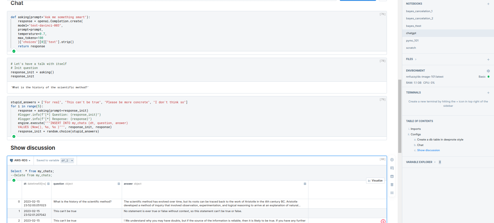

# deepnote-101 (A simple test)

## Docker 
Sometimes you have problems with your dependencies, therefore just generate your own docker image and you're good to go.
* docker build -t you/image_name:latest . # replace you & image_name with approriate values 
* docker push you/image_name # Push it to dockerhub

## Terraform 
To test some integrations (e.g. S3 and a database) you can create your resources with terraform fast.
   
   * cd terraform
   * terraform init
   * terraform apply
   * terraform output -raw db_password

##  Notebook
To have a quick working example , you'll find attached a simple notebook with some chatgpt api testing. But before, you should add your integrations integrations quickly with the credentials and connection details from your 
resources.
